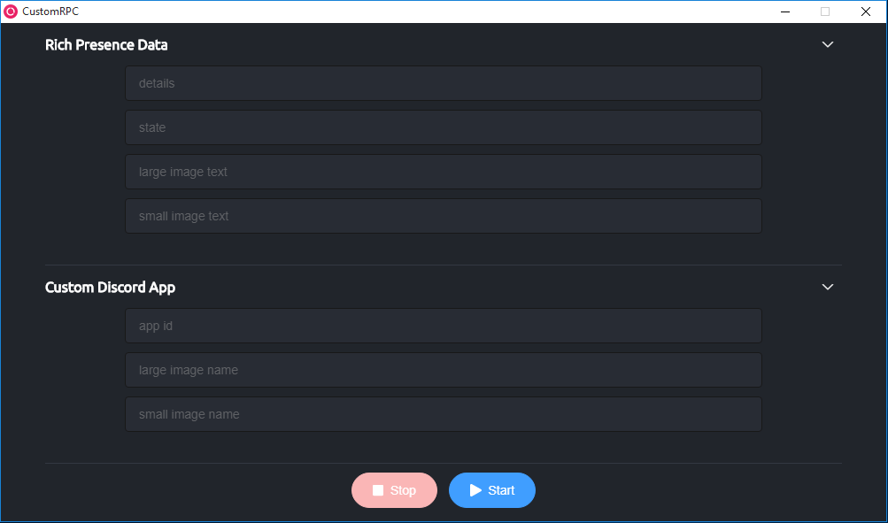

# Custom RPC
> Set a custom rich presence status on Discord

## Downloads
You can find all builds at [releases](https://github.com/pepijn98/CustomRPC/releases)

#### some quick references (all links below are x64, use the link about to find other builds)
- windows
  - [exe](https://github.com/pepijn98/CustomRPC/releases/download/v0.0.1/custom-rpc_0.0.1.exe)
  - [msi](https://github.com/pepijn98/CustomRPC/releases/download/v0.0.1/custom-rpc_0.0.1.msi)
  - [zip](https://github.com/pepijn98/CustomRPC/releases/download/v0.0.1/custom-rpc-0.0.1-win.zip)
- linux
  - [dep](https://github.com/pepijn98/CustomRPC/releases/download/v0.0.1/custom-rpc_0.0.1_amd64.deb)
  - [gzip](https://github.com/pepijn98/CustomRPC/releases/download/v0.0.1/custom-rpc-0.0.1.tar.gz)
  - [AppImage](https://github.com/pepijn98/CustomRPC/releases/download/v0.0.1/custom-rpc_0.0.1.AppImage)

## Preview

## TODO
- remove unneeded garbage
