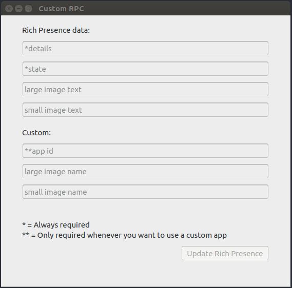
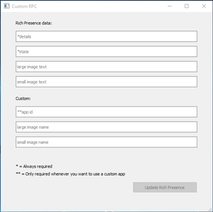

# CustomRPC
This is a simple app to set a custom rich presence in discord 
Only works for Linux and Windows as of now see below for all tested operating systems 

The linux executable can be found [here](https://github.com/KurozeroPB/CustomRPC/releases/download/v0.1.0/customrpc_0.1.0) 
The dep file can be found [here](https://github.com/KurozeroPB/CustomRPC/releases/download/v0.1.0/customrpc_0.1.0.deb) 
The windows build can be found [here](https://github.com/KurozeroPB/CustomRPC/releases/download/v0.1.0/customrpc_0.1.0-windows-x64.zip) 

*Honestly I don't even know if the windows build runs without python and qt4 
So if it doesn't see the build instructions below and install both.* 
 
See the [wiki](https://github.com/KurozeroPB/CustomRPC/wiki/Creating-and-using-a-Discord-app) on how to use CustomRPC with your own app for more customization. 
Check out [projects](https://github.com/KurozeroPB/CustomRPC/projects/1) to see what is planned for the future. 
## Previews
Linux                                 |Windows
:------------------------------------:|:------------------------------------:
  |  
**Result**                            |
|

## Building the app yourself
#### Requirements:
- [git](https://git-scm.com/downloads)
- [python 3.5](https://www.python.org/downloads/release/python-354/)
- [Qt4](https://www.qt.io/download)
- [PyQt4](https://www.lfd.uci.edu/~gohlke/pythonlibs/#pyqt4)
- [pyinstaller](https://www.pyinstaller.org/)

Installing git, python, Qt4 and pyinstaller are pretty straight forward. 
To get PyQt4 you need to download the `.whl` and then use pip to install it 
For example `pip install PyQt4‑4.11.4‑cp35‑cp35m‑win_amd64.whl` 

1. `git clone https://github.com/KurozeroPB/CustomRPC.git`
2. `cd CustomRPC`
3. `pyinstaller --onefile --windowed --name customrpc_0.1.0 main.py`

This will create an executable file in the `dist` folder
## Tested Operating Systems
- Linux Ubuntu 16.04 ✓
- Windows 10 ✓
